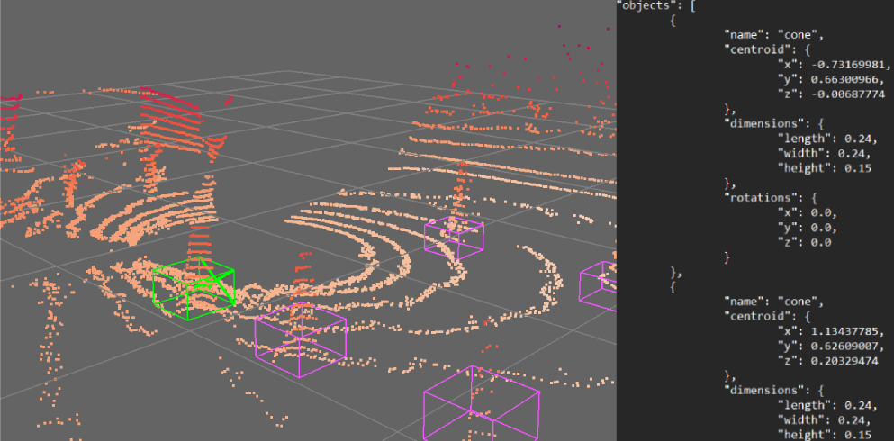
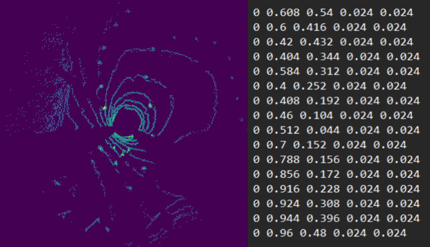
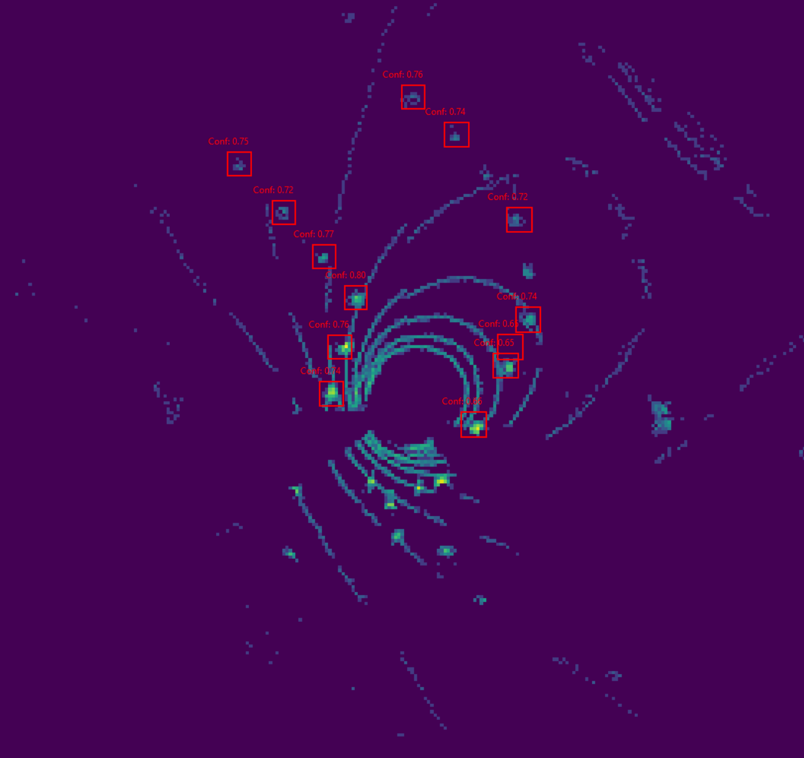
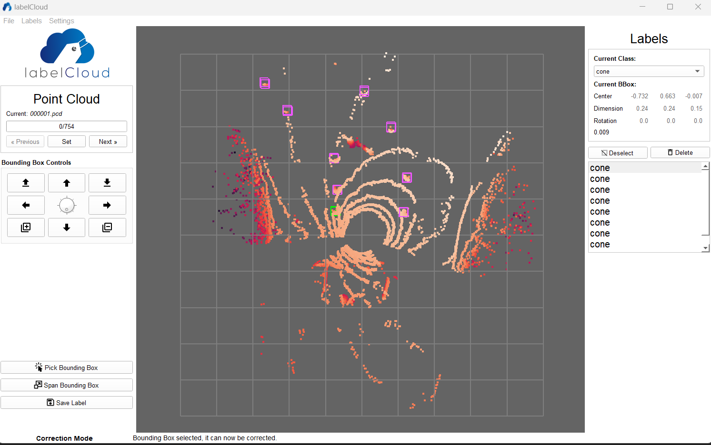
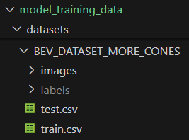
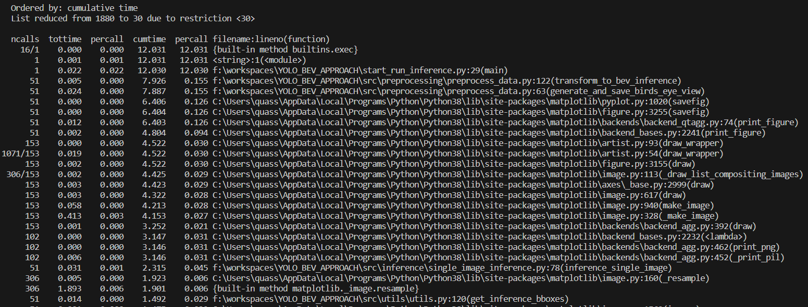

# Entwicklung und Konstruktion eines Rennwagens f. die Formula Student (Nierhoff) | Projektarbeit Carl Kueschall | Deep-Learning-Ansatz zur Erkennung und Lokalisierung von Pylonen in LiDAR-Punktwolken
In this project, the objective was to create a robust deep-learning model capable of accurately detecting traffic cones within lidar point clouds. Object detection within unordered point-cloud data poses a significant challenge, particularly when aiming for low inference times suitable for real-time applications, such as autonomous driving tests. The focus was on developing a solution that not only achieves high accuracy but also ensures swift inference, crucial for seamless integration into live performance scenarios. <br> 

Running Snail Wiki Link: [Deep-Learning-Ansatz zur Erkennung und Lokalisierung von Pylonen in LiDAR-Punktwolken
](http://rs-server/wiki/index.php/Deep-Learning-Ansatz_zur_Erkennung_und_Lokalisierung_von_Pylonen_in_LiDAR-Punktwolken#Walkthrough_Videos) <br>
This implementation extends and overhauls a solution developed by Alladin Persson, who has shared the core training loop code on his GitHub page. His implementation, in turn, is rooted in the original paper for YOLOv3. This project represents a significant enhancement of the original codebase, introducing an alternative medium-sized model architecture with approximately 8 million parameters instead of the original 60 million. Furthermore, it extends the functionality by providing easy-to-use preprocessing capabilities, enhanced model evaluation through logging and visualization, and a streamlined inference process, all of which are tailored to the purposes of cone detection in lidar point-clouds, for the 'Running Snail Autonomous Driving' team.

In this project I provide everything necessary to move from continuously incoming '.pcd' point-cloud data, to a 'deployed' model that can accurately predict the location of traffic cones.
The repository can be found at [carl_kueschall_pylonenerkennung_deeplearning_ansatz_yolov3](https://chat.openai.com). It facilitates the completion of the following steps in the deep learning lifecycle:


The codebase provided here facilitates the completion of the following steps in the deep learning lifecycle:
- **Lidar Labeling**
  - Use the 'labelCloud' software to label lidar point-clouds
- **Preprocessing**
  - Process labeled lidar data into a dataset fit for training a YOLOv3 model
- **Model Training**
  - Train a YOLOv3 model on the preprocessed dataset
- **Inference**
  - Use a trained model to predict bounding boxes for dynamically arriving point-clouds

## Summary of Method
To achieve the desired result, the approach presented in this project strikes a line between accuracy and speed. Although a model fit for processing point-clouds themselves, such as 'PointRCNN' would be capable of greater accuracy than the alternative, taking 'birds-eye-view' images of the point-clouds and using these representations as input for a YOLOv3 model results in a solution that is fast enough for real-time applications, sufficiently simple to implement and easier to interpret for the end-user.

First, point-clouds are labeled in 3D-Space using the labelCloud software. <br>
**Point-Cloud with its corresponding labelCloud Bounding Box Labels**


Then, a birds-eye-view image of the point-cloud is extracted and the labelCloud labels are transformed to a format fit for training the YOLOv3 model. <br>
**Birds-Eye-View (BEV) Image with its corresponding YOLO Bounding Box Labels | Format: {class_idx, x_center, y_center, width, height}**


Following this step the model is trained on the resulting dataset. It can then be evaluated and improved further. <br>
Once model performance is sufficient, it can be used for inference. The script responsible for inference waits for '.pcd' files in a specific folder and will immediately start processing them. It will do so sequentially, as the point-cloud data is expected to arrive continuously, coming from the Velodyne lidar sensor. It will save the predictions to a 'json' file and if enabled, plot them dynamically on-top of the original image, as seen below. 

**Inference Output Visualized**


**Making Use of the Model Output** <br>
The coordinates and thus the location of each cone, relative to the lidar sensor, can be extracted from the bounding box predictions and then further processed to determine the optimal trajectory for the Formula Student racecar.

## Installation

### Clone and install requirements
**Source Code Only**
```bash
$ git clone https://carl_kueschall@bitbucket.org/running-snail-as/carl_kueschall_pylonenerkennung_deeplearning_ansatz_yolov3.git
$ pip install requirements.txt
```
<br>

**Source Code + Benchmark Models**
```bash
$ git clone https://carl_kueschall@bitbucket.org/running-snail-as/carl_kueschall_pylonenerkennung_deeplearning_ansatz_yolov3.git
$ pip install requirements.txt
```
Download the benchmark model of your choice from [GoFile_Link_to_benchmark_models](https://gofile.io/d/9bO6yz), then place the '.tar' file in the 'model_inference_data/models/' folder.
<br>

**Source Code + Raw Data + Benchmark Models and Checkpoints**
```bash
$ git clone https://carl_kueschall@bitbucket.org/running-snail-as/carl_kueschall_pylonenerkennung_deeplearning_ansatz_yolov3.git
#Switch branch to branch_with_raw_data and pull the additional files on that branch
$ pip install requirements.txt
```
<br>

# Usage Guide
## Walkthrough Videos
- [Installation](https://www.youtube.com/watch?v=RgfRjD5T8-Y&list=PLofTTqZ4U3N8GGxASKon2VdBmM2mLhjm_&index=2)
- [Labeling](https://www.youtube.com/watch?v=m-87qb92dm4&list=PLofTTqZ4U3N8GGxASKon2VdBmM2mLhjm_&index=2)
- [Preprocessing](https://www.youtube.com/watch?v=MeQ3IQ_tH6E&list=PLofTTqZ4U3N8GGxASKon2VdBmM2mLhjm_&index=3)
- [Training](https://www.youtube.com/watch?v=xqBYDEYFD04&list=PLofTTqZ4U3N8GGxASKon2VdBmM2mLhjm_&index=4)
- [Evaluation](https://www.youtube.com/watch?v=s1US76yQ8ss&list=PLofTTqZ4U3N8GGxASKon2VdBmM2mLhjm_&index=5)
- [Inference](https://www.youtube.com/watch?v=oaEEmvA3XnE&list=PLofTTqZ4U3N8GGxASKon2VdBmM2mLhjm_&index=6)


## Lidar Labeling
To label lidar point-clouds, the labelCloud software can be utilized. It provides a simple user interface that works well for the purposes of this project. 

### Installation and Setup
#### Via pip
```bash
$ pip install labelCloud
$ labelCloud --example
```

#### Via git (manually)
```bash
1. Clone Repository
$ git clone https://github.com/ch-sa/labelCloud.git
2. Install requirements
$ pip install -r requirements.txt
3. Copy point clouds into `pointclouds` folder.
4. Start labelCloud 
$ python3 labelCloud.py
```

#### Naming Convention
Make sure that the '.pcd' files follow the naming convention for this project. Each filename should adhere to this format: <br>
- The filename should simply be an index, represented by six figures under all conditions
- Examples
  - 000001.pcd
  - 000002.pcd
  - ...
  - 004393.pcd

#### Folder Structure
Once the labelCloud service has been started inside the project directory, the folders for the input '.pcd' files can be configured inside the settings menu, as well as the output directory for the labels. <br>
For the purposes of this project, a certain folder structure should be met, to simplify the setup process. If you wish to create your own structure for this process, then make sure to adjust the paths in the **'config.py'** file. <br>

```txt
Project Directory
├───label_cloud_project
│   ├───datastore
│   │   ├───labels
│   │   │   ├───label_cloud_labels
│   │   └───pointclouds
│   │       |───raw_pcds
|   |       |___cropped_pcds
```

#### Settings
In the settings menu, set the 'Point Cloud Folder' to the 'raw_pcds' directory. Then, set the 'Label Folder' to the 'label_cloud_labels' directory. <br>
Next, configure the rest of the settings. <br>

**Recommended Configuration:**
- Label Format: centroid_abs
- Default Object Class: cone
- Standard Bounding Box Length: 0.240
- Standard Bounding Box Width: 0.240
- Standard Bounding Box Height: 0.240
- Keep last Perspective between Point Clouds: Unchecked

#### **Point-Clouds must be Cropped before Labeling!!!**
Because the point-clouds recorded by the Velodyne sensor span across a far greater distance than the point at which the data becomes unusable and irrelevant for the model, the files should be cropped first, before starting the labeling process. This will make labeling much more enjoyable.
**Refer to the chapter on preprocessing for this step**. **The preprocessing script covers the cropping of point-clouds already**, meaning that simply running it over the raw, uncropped point-cloud data is an easy way to do it. Once the script has finished, simply extract the cropped point-clouds from the 'pcd' folder in "model_training_data/datasets/{YOUR_DATASET_NAME}" and place them in the 'raw_pcds' folder as discussed earlier.

### Using labelCloud
Fitting bounding boxes (bboxes) in 3D space can be a laborous and lengthy process. For this reason I developed a fairly efficient method for labeling point-clouds in the labelCloud user-interface, that allows a processing speed of about 10 seconds per file, depending on the number of cones visible in the cloud. 

Having set up the default length, width and height of the bboxes, one can simply click the 'Pick Bounding Box' button in the bottom-left corner and then drag the cube on-top of a traffic cone in the point-cloud. Since the point-clouds have already been cropped, whenever the user moves on to the next file, the user-interface will display it from a 'birds-eye-view' perspective, in which the user can immediately start labeling, without having to adjust the 3D space first.

**IMPORTANT NOTE** <br>
Make sure to stay within the bounds of the overlayed grid when placing the bboxes, as anything outside these bounds will be filtered out in preprocessing, meaning that the bbox won't be considered in training.

## Preprocessing
Before starting the preprocessing script **'start_training_data_preprocessing.py'**, have a look at the relevant constants in the **'config.py'** configuration file. Make sure the paths point to the right source directories and that you've set up a new dataset name, under which a folder will be created that will contain the dataset. <br>

**'config.py'** excerpt:
```python
PCD_CROP_DISTANCE_THRESHOLD = 5.0 

NEW_DATASET_NAME = '<your_new_dataset_name>' 

#input dirs
RAW_PCD_FOLDER = 'label_cloud_project/datastore/pointclouds/raw_pcds' 
LABEL_CLOUD_LABEL_FOLDER = 'label_cloud_project/datastore/labels/label_cloud_labels' 

#output dirs
YOLO_LABEL_FOLDER = f'model_training_data/datasets/{NEW_DATASET_NAME}/labels' 
BEV_IMAGE_FOLDER = f'model_training_data/datasets/{NEW_DATASET_NAME}/images' 
CROPPED_PCD_FOLDER = f'model_training_data/datasets/{NEW_DATASET_NAME}/pcd'

STORE_CROPPED_PCD_FOR_LABELING = False 

PREPROCESSING_TRAIN_SPLIT_RATIO = 0.7 
```
The script will first transform the labelCloud centroid labels into the YOLO label format. Then it will move on to cropping and transforming the point-clouds into 'birds-eye-view' images. The cropped point-clouds from the labeling process can be used as input as well, they won't be cropped further that is not an issue. Lastly it will create a train-test split and store the information in '.csv' files. Now the dataset is ready for model training.

Example structure following preprocessing: <br>



## Training
First, make sure to edit the **'config.py'** configuration file. <br>
**Example for a fresh training run:**<br>
**'config.py'** excerpt:
```python
DATASET = '{MY_NEW_DATASET_NAME}'
RUN_TITLE = '{FIRST_TEST}'
...
LEARNING_RATE = 1e-4
WEIGHT_DECAY = 1e-4
NUM_EPOCHS = 100
CONF_THRESHOLD = 0.7
...
LOAD_MODEL = False
...
SAVE_CHECKPOINTS = True
...
```
These are the most important settings and parameters to keep in mind. I recommend reading through the in-line documentation in **'config.py'** should other settings require modification.

Now the script **'start_run_training.py'** can be run to start the training process. Depending on the configuration, the script will save checkpoints, periodically print evaluation metrics and once finished store model results in the appropriate folder.

## Evaluation
The script **'evaluation.py'** allows the evaluation of the performance of a trained model. To configure this process, the relevant constants in **'config.py'** can be modified. This can be crucial, as the confidence- as well as the IOU-threshold determine the output of post-processing and thus the evaluation metrics. There's an option to dynamically find a threshold that will result in a certain amount of bboxes. This is extremely useful to get an idea of the models' performance in experimental training sessions. If necessary the user can temporarily modify the test split to evaluate the model on a specific set of samples.

In **'config.py'**, enable EVALUATION_PLOT_RESULTS to have the script visualize results as well. Note that no class labels are shown in the visualization, which is due to the fact that this use-case only predicts bboxes for a single class, meaning that labels only clutter the screen and provide no information to the user.

## Inference
Once a model has been trained and the performance is deemed sufficient, the script **'start_run_inference.py'** can be run to perform inference, or in other words, use the model in a real-world application. It will wait for new '.pcd' files inside the INFERENCE_PCD_FOLDER and upon their arrival, will immediately start processing them. Should the option INFERENCE_SHOW_LIVE_RESULTS be enabled, then the results will also be dynamically plotted in a separate window. The bounding box predictions will be stored in the corresponding folder defined by INFERENCE_RESULTS_FOLDER.

**Data-Source:** <br>
PCD files from the "Velodyne Lidar_x2023_04_01_10_33_51_Velodyne_VLP_16Hi_Res_Data" capture, which can be found in the [Pyloneneerkenner3000](https://github.com/N0tAScooby/Pylonenerkenner3000/tree/carl_deep-learning/pcd_files)
 repository.


# Results
**Hardware:**
- GPU
  - NVIDIA GeForce RTX 4080
- CPU
  - AMD Ryzen 7 7800X3D 8-Core Processor
- Memory
  - 32 GB 6000Mhz DDR5
- Storage
  - Crucial BX500 1 TB SSD (Read: 540Mb/s | Write: 500Mb/s)

## Model Performance
Evaluating the large and medium model on a test set of 40 point-clouds picked randomly from a dataset of 400 resulted in the following scores:

| Model                   |        Training Dataset         |Confidence Thresh| IOU Thresh    |Mean Average Precision (mAP)         |
| ------------------------|---------------------------------|----------------|----------------|------------|
| YOLOv3_large (~60mil params)	  | PCD files 0-400                 |   0.7          |0.2             |   0.8585   |
| YOLOv3_medium (~8mil params)   | PCD files 0-400                 |   0.65         |0.2             |   0.8034   |


## Inference Speeds
**Medium Model** <br>
Profiling results when performing inference for 50 samples:


The actual model inference time, translates to an average of **0.045 seconds per sample**.

**Large Model** <br>
Profiling results when performing inference for 10 samples:


The actual model inference time, translates to an average of **0.053 seconds per sample**.

In both cases most of the remaining time spent per sample is consumed by the preprocessing step of transforming the point clouds to BEV images, as expected. Some time is lost post-processing the output of the model, applying non-max-suppression etc.

Note that for these tests the plotting of live-results, as well at the storing of BEV images was disabled in **'config.py'** to minimize computational load per sample.


# Outlook
In the future, this implementation could be utilized to train the YOLOv3 model on a significantly larger dataset, ideally showcasing greater variance in the point clouds themselves. Additionally, to enhance the model's ability to detect traffic cones at a wider range, I personally consider an improvement in the lidar capturing process to be necessary. The current resolution at which the sensor captures cones located farther than approximately five meters from the sensor is insufficient for the model to differentiate them from noise. <br>
Should the format of lidar data arriving from the sensor in a live-capturing scenario differ from the '.pcd' format, adjustments will need to be made in preprocessing.

Currently this project operates on three anchors, which are, as documented in **'config.py'**, starting points for bounding boxes, which the YOLOv3 model adjusts in training. They aid the model in learning to detect objects of different shapes and sizes. For detecting equally-shaped and -sized traffic-cones however, this is not required. They remain in this project for future-proofing and simplification, but aren't absolutely necessary. 

Performance-wise, the model currently exhibits decent performance when confronted with brand new point cloud data. It is important to note however, that even brand new data in this circumstance, consists of point clouds, or rather BEV images, that are remarkably similar to the ones the model will encounter in training. This means that even if the model heavily overfits at the moment, this symptom is hard to notice when evaluating the model and performing inference. As I previously mentioned, issues such as this can be solved by training the model on a much greater dataset, incorporating regularization methods and more. The benchmark models, large and medium, were trained on 400 samples for reference.

Lastly, one method that could be of interest to future contributors to this project, is that of considering past results for future predictions. More specifically, utilizing the positions of traffic-cones in the past couple of frames in training. For instance, the positions of point clouds 400, 401 and 402 could be fed as a second input to the model for the number 403 point cloud.
# Sources
[GitHub Repository YOLOv3 Implementation | Alladin Persson | https://github.com/aladdinpersson/Machine-Learning-Collection](https://github.com/aladdinpersson/Machine-Learning-Collection)

[YOLOv3 Paper | Redmon, Joseph and Farhadi, Ali | https://arxiv.org/abs/1804.02767](https://arxiv.org/abs/1804.02767)

[OpenAI | Chat-GPT 3.5 / 4.0 | https://chat.openai.com](https://chat.openai.com)

## YOLOv3 paper
### An Incremental Improvement 
by Joseph Redmon, Ali Farhadi

#### Abstract
We present some updates to YOLO! We made a bunch of little design changes to make it better. We also trained this new network that’s pretty swell. It’s a little bigger than last time but more accurate. It’s still fast though, don’t worry. At 320 × 320 YOLOv3 runs in 22 ms at 28.2 mAP, as accurate as SSD but three times faster. When we look at the old .5 IOU mAP detection metric YOLOv3 is quite good. It achieves 57.9 AP50 in 51 ms on a Titan X, compared to 57.5 AP50 in 198 ms by RetinaNet, similar performance but 3.8× faster. As always, all the code is online at https://pjreddie.com/yolo/.

```
@article{yolov3,
  title={YOLOv3: An Incremental Improvement},
  author={Redmon, Joseph and Farhadi, Ali},
  journal = {arXiv},
  year={2018}
}
```