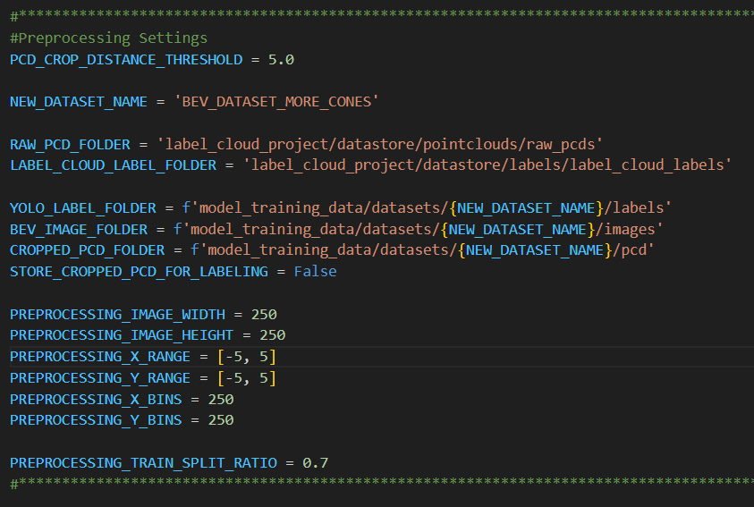

# Entwicklung und Konstruktion eines Rennwagens f. die Formula Student (Nierhoff) | Projektarbeit Carl Kueschall | Deep-Learning Ansatz | Pylonenerkennung anhand von YOLOv3 in PyTorch
The task was to develop a deep-learning model that is able to perform object detection to determine the location of traffic cones inside lidar point clouds. In this project I provide everything necessary to move from raw sensor data, to a 'deployed' model that can accurately predict the location of traffic cones on continuously incoming '.pcd' point-cloud data.

This package provides the means to complete the following steps in the Deep-Learning Lifecycle:
- **Lidar Labeling**
  - Using the 'labelCloud' software, label lidar point-clouds
- **Preprocessing**
  - Process labeled lidar data into a dataset fit for training a YOLOv3 model
- **Model Training**
  - Train a YOLOv3 model on the preprocessed dataset
- **Inference**
  - Use a trained model to predict bounding boxes for dynamically arriving point-clouds
## Installation

### Clone and install requirements
```bash
$ git clone https://github.com/aladdinpersson/Machine-Learning-Collection
$ cd ML/Pytorch/object_detection/YOLOv3/
$ pip install requirements.txt
```

## Lidar Labeling
To label lidar point-clouds, the labelCloud software can be utilized. It provides a simple user interface that works well for the purposes of this project. 

### Installation and Setup
#### Via pip
```bash
$ pip install labelCloud
$ labelCloud --example
```

#### Via git (manually)
```bash
1. Clone Repository
$ git clone https://github.com/ch-sa/labelCloud.git
2. Install requirements
$ pip install -r requirements.txt
3. Copy point clouds into `pointclouds` folder.
4. Start labelCloud 
$ python3 labelCloud.py
```

#### Naming Convention
Make sure that the '.pcd' files follow the naming convention for this project. Each filename should adhere to this format: <br>
- The filename should simply be an index, represented by six figures under all conditions
- Examples
  - 000001.pcd
  - 000002.pcd
  - ...
  - 004393.pcd

#### Folder Structure
Once the labelCloud service has been started inside the project directory, the folders for the input '.pcd' files can be configured inside the settings menu, as well as the output directory for the labels. <br>
For the purposes of this project, a certain folder structure should be met, to simplify the setup process. If you wish to create your own structure for this process, then make sure to adjust the paths in the 'config.py' file. <br>

```txt
Project Directory
├───label_cloud_project
│   ├───datastore
│   │   ├───labels
│   │   │   ├───label_cloud_labels
│   │   └───pointclouds
│   │       └───raw_pcds
```

#### Settings
In the settings menu, set the 'Point Cloud Folder' to the 'raw_pcds' directory. Then, set the 'Label Folder' to the 'label_cloud_labels' directory. <br>
Next, configure the rest of the settings. <br>

**Reccomended Configuration:**
- Label Format: centroid_abs
- Default Object Class: cone
- Standard Bounding Box Length: 0.240
- Standard Bounding Box Width: 0.240
- Standard Bounding Box Height: 0.240
- Keep last Perspective between Point Clouds: Unchecked

#### **Point-Clouds must be Cropped before Labeling!!!**
Because the point-clouds recorded by the Velodyne sensor span across a far greater distance than the point at which the data becomes unusable and irrelevant for the model, the files should be cropped first, before starting the labeling process. This will make labeling much more enjoyable.
**Refer to the chapter on preprocessing for this step**. **The preprocessing script covers the cropping of point-clouds already**, meaning that simply running it over the raw, uncropped point-cloud data is an easy way to do it. Once the script has finished, simply extract the cropped point-clouds from the 'pcd' folder in "model_training_data/datasets/{YOUR_DATASET_NAME}" and place them in the 'raw_pcds' folder as discussed earlier.

### Using labelCloud
Fitting bounding boxes (bboxes) in 3D space can be a laborous and lengthy process. For this reason I developed a fairly efficient method for labeling point-clouds in the labelCloud user-interface, that allows a processing speed of about 10 seconds per file, depending on the number of cones visible in the cloud. 

Having set up the default length, width and height of the bboxes, one can simply click the 'Pick Bounding Box' button in the bottom-left corner and then drag the cube on-top of a traffic cone in the point-cloud. Since the point-clouds have already been cropped, whenever the user moves on to the next file, the user-interface will display it from a 'birds-eye-view' perspective, in which the user can immediately start labeling, without having to adjust the 3D space first.

**IMPORTANT NOTE** <br>
Make sure to stay within the bounds of the overlayed grid when placing the bboxes, as anything outside these bounds will be filtered out in preprocessing, meaning that the bbox won't be considered in training.

## Preprocessing
Before starting the preprocessing script 'start_training_data_preprocessing.py', have a look at the relevant constants in the 'config.py' configuration file. Make sure the paths point to the right source directories and that you've set up a new dataset name, under which a folder will be created that will contain the dataset. <br>


The script will first transform the labelCloud centroid labels into the YOLO label format. Then it will move on to cropping and transforming the point-clouds into 'birds-eye-view' images. The cropped point-clouds from the labeling process can be used as input as well, they won't be cropped further that is not an issue. Lastly it will create a train-test split and store the information in '.csv' files. Now the dataset is ready for model training.

Example structure following preprocessing: <br>


## Training
Edit the config.py file to match the setup you want to use. Then run train.py

## Inference

### First Results
| Model                   | mAP @ 20 IoU          |  Test.csv  | 
| ----------------------- |:---------------------:|------------|
| YOLOv3_custom_large (VeloDyne 16 PCD 0-200) 	  | 97.5       |
| YOLOv3_custom_medium (VeloDyne 16 PCD 0-200)    | 83.5       |

The models were evaluated with confidence 0.7 and IOU threshold 0.2 using NMS.


## Sources


## YOLOv3 paper
The implementation is based on the following paper:

### An Incremental Improvement 
by Joseph Redmon, Ali Farhadi

#### Abstract
We present some updates to YOLO! We made a bunch of little design changes to make it better. We also trained this new network that’s pretty swell. It’s a little bigger than last time but more accurate. It’s still fast though, don’t worry. At 320 × 320 YOLOv3 runs in 22 ms at 28.2 mAP, as accurate as SSD but three times faster. When we look at the old .5 IOU mAP detection metric YOLOv3 is quite good. It achieves 57.9 AP50 in 51 ms on a Titan X, compared to 57.5 AP50 in 198 ms by RetinaNet, similar performance but 3.8× faster. As always, all the code is online at https://pjreddie.com/yolo/.

```
@article{yolov3,
  title={YOLOv3: An Incremental Improvement},
  author={Redmon, Joseph and Farhadi, Ali},
  journal = {arXiv},
  year={2018}
}
```